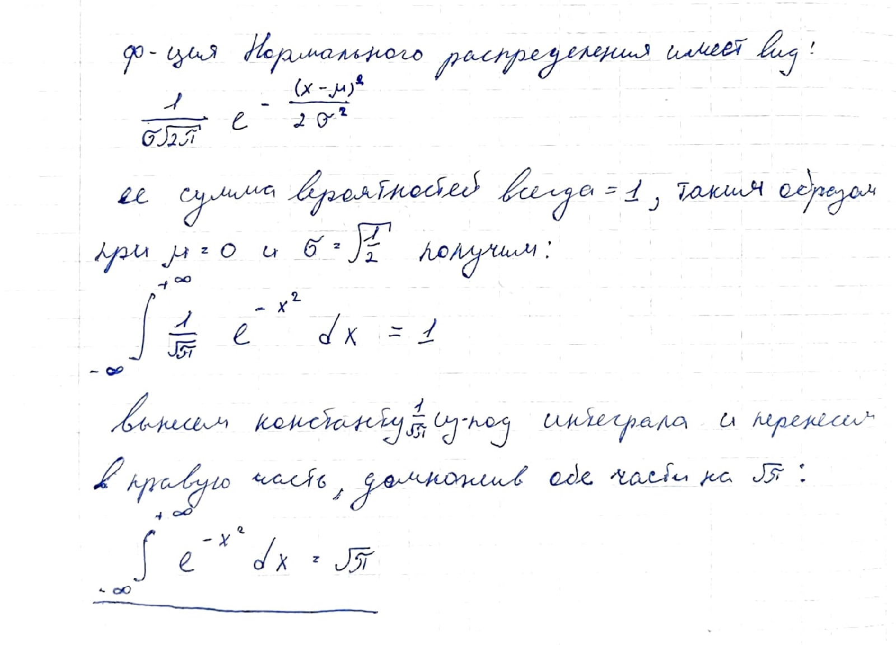

# MailRuInternSpring2022

"Практические" задачи с ртбора на стажировку 2022, стажёр-data scientist AliExpress Россия, 1 этап тестирование "машинное обучение"

## Задача с интегралом:
Найти значение интеграла с использованием знаний мат статисткики


## Градиентный бустинг
Продемострировать значимость предварительной обработки данных с использованием одной из библиотек градиентного бустнга - [жмяк](Mail_Intern_Boosting.ipynb) (CatBoost почемуто не было в списке)

## НС перевод
Использовать предобученную модель НС из [моделей huggingface](https://huggingface.co/Helsinki-NLP/opus-mt-en-ru) для перевода 100 предложений из датасета 20newsgroups с английского на русский - [тык](Mail_Intern_Translation.ipynb)

## Задача номер последняя
Вам приходят уведомления в среднем от 10 приложений в день, требуется найти аероятность получить уведомления от 20 и более приложений за день - [решение](Mail_Intern_Puasson.ipynb)

## SQL
Выбрать из таблицы имена учеников со средней оценкой выше 3.5
id  | name | subject | mark 
--- | ---  | ---     | --- |
```sql
SELECT `name`, AVG(`mark`) as `avg_mark` FROM `student_scores`
GROUP BY `name` HAVING `avg_mark` > 3.5;
```

## Работа с терминалом 1
Вывести количесво не пустых строк в фалах python в данном каталоге, сключаяя все его подкаталоги
```bash
$ find catalog/ -name "*.py" | xargs cat | grep -c -e ".+" # но тут не работает regexp
поэтому используем это:
$ find catalog/ -name "*.py" | xargs cat | grep -c -e "...*"
```

## Работа с терминалом 2
Вывести в файл уникальные названия картинок, хранящихся в первой колонке 2ух .csv файлов выполнив команду длиной в одну строку
```bash
$ cat val.csv train.csv | grep ".*.jpg" | cut -d "," -f 1 | sort | uniq > filenames.txt
```
